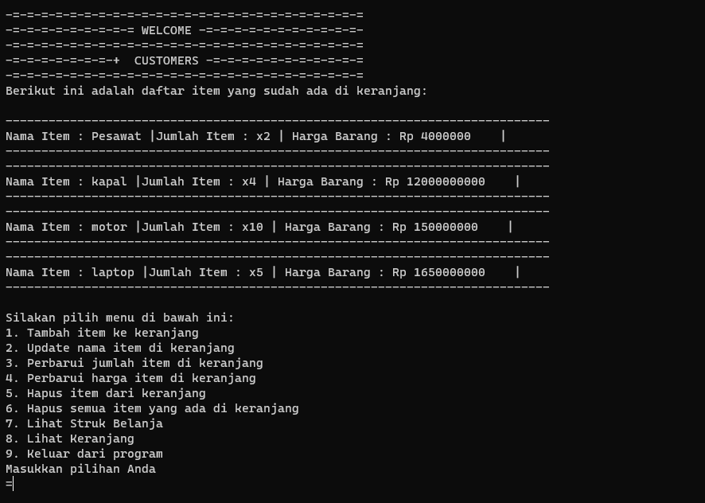

# Final_Project
Python Project 
Introduction to Software & Data Engineering with Python, Sekolah Engineering, Pacmann

-Background Project/Tujuan
Andi adalah seorang pemilik supermarket besar di salah satu kota di Indonesia. Andi memiliki rencana untuk melakukan perbaikan proses bisnis, yaitu Andi akan membuat sistem kasir yang self-service di supermarket miliknya dengan harapan 
Customer bisa langsung memasukkan item yang dibeli, jumlah item yang dibeli, dan harga item yang dibeli dan fitur yang lain.
Customer yang tidak berada di kota tersebut bisa membeli barang dari supermarket tersebut. 
Setelah Andi melakukan riset, ternyata Andi memiliki masalah, yaitu Andi membutuhkan Programmer untuk membuatkan fitur - fitur agar sistem kasir self-service di supermarket itu bisa berjalan dengan lancar.

-Cara Menggunakan Program
1.Download semua file/module Python ke dalam satu direktori lokal.
2.Compaile script.py di compailer anda
3.setelah di compaile anda diminta untuk memasukkan nama anda
4.dan terdapat 9 pilihan yang bisa anda coba

-Hasil Test Case
1.Customer ingin menambahkan dua item baru menggunakan method add_item(). Item yang ditambahkan adalah sebagai berikut:

2.Ternyata Customer salah membeli salah satu item dari belanjaan yang sudah ditambahkan, maka Customer menggunakan method delete_item() untuk menghapus item. Item yang ingin dihapuskan adalah mobil

3.Ternyata setelah dipikir - pikir Customer salah memasukkan item yang ingin dibelanjakan! Daripada menghapusnya satu - satu, maka Customer cukup menggunakan method reset_transaction() untuk menghapus semua item yang sudah ditambahkan.

4.Setelah Customer selesai berbelanja, akan menghitung total belanja yang harus dibayarkan menggunakan method check_out() . Sebelum mengeluarkan output total belanja akan menampilkan item - item yang dibeli.

-Penjelasan Fungsi
Didalam codingan ini terdapat 7 fungsi yang membantu program kasir tersebut

1.def Membuat_nomor_Transaksi():
Fungsi ini digunakan untuk membuat nomor transaksi secara random ketika kita struk belanja kita keluar menggunakan random.randint(100000, 999999) untuk membuat angka acak

2.def tambah_item():
Fungsi ini jelas sangat diperlukan untuk menambahkan barang di semua program kasir

3.def perbarui_nama_item():,def perbarui_jumlah_item(),def perbarui_harga_item():
Fungsi ini digunakan ketika kita salah menginput nama atau jumlah atau juga harga item yang kita masukkan maka dengan ketiga fungsi ini ketiga permasalahan itu akan terpecahkan

4.def hapus_item():
Fungsi ini digunakan untuk menghapus salah satu item yang dimana kita tidak ingin memmbeli item tersebut 

5.def print_struk():
Fungsi ini berguna untuk membuat struk ketika kita sudah selesai belanja, nah di fungsi ini saya menambahkan beberapa attribute yaitu menambahkan nama,datetame dan nomor transaksi untuk membuat struk tersbut
lebih bagus

-Penjelasan Flowchart

dikarenakan saya sudah menjelaskan fungsi sekarang saya ingin menjelaskan fungsi dari keseluruhan program tersebut/alur jalannya program

Digambar 1 kita bisa melihat ketika programnya di run kita disuruh untuk menginputkan nama kita, setelah kita menginput nama kita maka akan muncul kata sambutan dan ke 9 opsi yang disediakan program
Bisa dilhat di gambar 1 ada 2 pilihan yang terlihat yaitu Tambah item ke keranjang, Update nama item di keranjang, Perbarui jumlah item di keranjang,Perbarui harga item di keranjang, Hapus item dari keranjang, Hapus semua item yang ada di keranjang ,Lihat Struk Belanja,Lihat Keranjang ,Keluar dari program. 
dari flowchart diatas mereka akan terus melakukan looping hingga user memilih piliha mengakhiri program di opsi 9

-Kesimpulan
Di projek ini saya belajar bagaimana mengkombinasikan fungsi kedalam sebuah program dan menjadikan program tersebut memiliki berbagai banyak fungsi yang menarik bagi para user
dan juga dengan projek ini saya semakin ingin tau dan belajar untuk mengasah skill saya agar semakin maju dan berguna untuk kedepannya